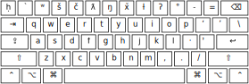
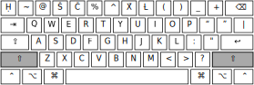
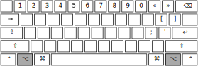
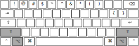

This is the keyboard layout:

### Default

### Shift

### Alt

Note: the "alt" layer should be active under one the following
conditions:

 * Either <kbd>Alt</kbd> or <kbd>Option</kbd> key is pressed.
 * The right <kbd>Alt</kbd> or <kbd>Option</kbd> key is pressed.
 * <kbd>Ctrl</kbd> and <kbd>Alt</kbd> are pressed simultaneously

Choose ONE of the above options according to what is most common in the
implementation platform.

### Alt + Shift

Remapped key sequences
----------------------

The following table lists keys and the output Unicode code points
required for the Qʷi·qʷi·diččaq keyboard. The key sequences in this
table **override** keys on an ANSI QWERTY keyboard layout.

|Key sequence        | Preview            | Unicode output     |
|--------------------|--------------------|--------------------|
| \`                 | ḥ                  | U+1E25             |
| ~                  | Ḥ                  | U+1E24             |
| <AltGr\>\+&grave;  | &grave;            | U+0060             |
| <AltGr\>\+~        | ~                  | U+007E             |
| 2                  | ʷ                  | U+02B7             |
| <AltGr\>\+2        | 2                  | U+0032             |
| 3                  | š                  | U+0161             |
| \#                 | Š                  | U+0160             |
| <AltGr\>\+3        | 3                  | U+0033             |
| <AltGr\>\+\#       | \#                 | U+0023             |
| 4                  | č                  | U+010D             |
| $                  | Č                  | U+010C             |
| <AltGr\>\+4        | 4                  | U+0034             |
| <AltGr\>\+$        | $                  | U+0024             |
| 5                  | ƛ                  | U+019B             |
| <AltGr\>\+5        | 5                  | U+0035             |
| 6                  | ŋ                  | U+014B             |
| <AltGr\>\+6        | 6                  | U+0036             |
| 7                  | x̌                  | U+0078;U+030C      |
| &                  | X̌                  | U+0058;U+030C      |
| <AltGr\>\+7        | 7                  | U+0037             |
| <AltGr\>\+&        | &                  | U+0026             |
| 8                  | ɫ                  | U+026B             |
| \*                 | Ɫ                  | U+2C62             |
| <AltGr\>\+8        | 8                  | U+0038             |
| <AltGr\>\+\*       | \*                 | U+002A             |
| 9                  | Ɂ                  | U+0241             |
| <AltGr\>\+9        | 9                  | U+0039             |
| 0                  | °                  | U+00B0             |
| <AltGr\>\+0        | 0                  | U+0030             |
| \[                 | ‘                  | U+2018             |
| \{                 | “                  | U+201C             |
| <AltGr\>\+\[       | \[                 | U+005B             |
| <AltGr\>\+\{       | \{                 | U+007B             |
| \]                 | ’                  | U+2019             |
| \}                 | ”                  | U+201D             |
| <AltGr\>\+\]       | \]                 | U+005D             |
| <AltGr\>\+\}       | \}                 | U+007D             |
| ;                  | ·                  | U+00B7             |
| &apos;             | ◌̓                  | U+0313             |
| <AltGr\>\+;        | ;                  | U+003B             |
| <AltGr\>\+&apos;   | &apos;             | U+0027             |

A few notes:

 1. The <kbd>&apos;</kbd> outputs a combining character. This character,
    U+0313 combing comma above
    indicates a glottalized version of a modified consonant, e.g,
    <kbd>k</kbd>+<kbd>&apos;</kbd> = ⟨k̓⟩.
 2. Both ⟨x̌⟩ and ⟨X̌⟩ do not have a single code point used to reprsent
    them; instead, a pair of code points is used, and thus, one
    keystroke should output two code points for both of these
    characters.
