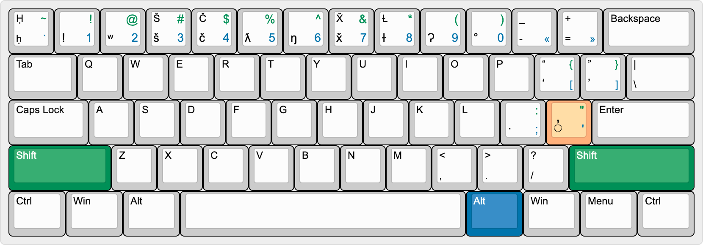

This is the keyboard layout for physical keyboards:

<aside>
<a href="http://www.keyboard-layout-editor.com/#/gists/90db9f968bb5911833d0cb37211c0a1e>">Image source</a>
</aside>

Note: the exact key or keys represented by <kbd>Alt</kbd> is dependent
upon the platform's conventions:

 - Either <kbd>Alt</kbd> or <kbd>Option</kbd> key is pressed.
 - The right <kbd>Alt</kbd> or right <kbd>Option</kbd> key is pressed.
 - <kbd>Ctrl</kbd> and <kbd>Alt</kbd> are pressed simultaneously

Choose ONE of the above options according to what is most common in the
implementation platform.

Remapped key sequences
----------------------

The following table lists keys and the output Unicode code points
required for the Qʷi·qʷi·diččaq keyboard. The key sequences in this
table **override** keys on an ANSI QWERTY keyboard layout.

When a key has a modifier, it means to press the key in addition to the
modifier(s) in order to get the result.

| Modifier                        | Key               | Preview | Unicode output |
|                                 | <kbd>`</kbd>      | ḥ       | 1E25           |
|                                 | <kbd>1</kbd>      | !       | 0021           |
|                                 | <kbd>2</kbd>      | ʷ       | 02B7           |
|                                 | <kbd>3</kbd>      | š       | 0161           |
|                                 | <kbd>4</kbd>      | č       | 010D           |
|                                 | <kbd>5</kbd>      | ƛ       | 019B           |
|                                 | <kbd>6</kbd>      | ŋ       | 014B           |
|                                 | <kbd>7</kbd>      | x̌       | 0078;030C      |
|                                 | <kbd>8</kbd>      | ɫ       | 026B           |
|                                 | <kbd>9</kbd>      | Ɂ       | 0241           |
|                                 | <kbd>0</kbd>      | °       | 00B0           |
|                                 | <kbd>[</kbd>      | ‘       | 2018           |
|                                 | <kbd>[</kbd>      | ’       | 2019           |
|                                 | <kbd>:</kbd>      | ·       | 00B7           |
|                                 | <kbd>&#x27;</kbd> | ◌̓       | 0313           |
| <kbd>Shift</kbd>                | <kbd>`</kbd>      | Ḥ       | 1E24           |
| <kbd>Shift</kbd>                | <kbd>3</kbd>      | Š       | 0160           |
| <kbd>Shift</kbd>                | <kbd>4</kbd>      | Č       | 010C           |
| <kbd>Shift</kbd>                | <kbd>7</kbd>      | X̌       | 0058;030C      |
| <kbd>Shift</kbd>                | <kbd>8</kbd>      | Ɫ       | 2C62           |
| <kbd>Shift</kbd>                | <kbd>[</kbd>      | “       | 201C           |
| <kbd>Shift</kbd>                | <kbd>[</kbd>      | ”       | 201D           |
| <kbd>Alt</kbd>                  | <kbd>`</kbd>      | &#x60;  | 0060           |
| <kbd>Alt</kbd>                  | <kbd>1</kbd>      | 1       | 0031           |
| <kbd>Alt</kbd>                  | <kbd>2</kbd>      | 2       | 0032           |
| <kbd>Alt</kbd>                  | <kbd>3</kbd>      | 3       | 0033           |
| <kbd>Alt</kbd>                  | <kbd>4</kbd>      | 4       | 0034           |
| <kbd>Alt</kbd>                  | <kbd>5</kbd>      | 5       | 0035           |
| <kbd>Alt</kbd>                  | <kbd>6</kbd>      | 6       | 0036           |
| <kbd>Alt</kbd>                  | <kbd>7</kbd>      | 7       | 0037           |
| <kbd>Alt</kbd>                  | <kbd>8</kbd>      | 8       | 0038           |
| <kbd>Alt</kbd>                  | <kbd>9</kbd>      | 9       | 0039           |
| <kbd>Alt</kbd>                  | <kbd>0</kbd>      | 0       | 0030           |
| <kbd>Alt</kbd>                  | <kbd>-</kbd>      | «       | 00AB           |
| <kbd>Alt</kbd>                  | <kbd>=</kbd>      | »       | 00BB           |
| <kbd>Alt</kbd>                  | <kbd>[</kbd>      | [       | 005B           |
| <kbd>Alt</kbd>                  | <kbd>[</kbd>      | ]       | 005D           |
| <kbd>Alt</kbd>                  | <kbd>\</kbd>      | &#x5c;  | 005C           |
| <kbd>Alt</kbd>                  | <kbd>:</kbd>      | ;       | 003B           |
| <kbd>Alt</kbd>                  | <kbd>&#x27;</kbd> | &quot;  | 0022           |
| <kbd>Alt</kbd>                  | <kbd>,</kbd>      | ,       | 002C           |
| <kbd>Alt</kbd>                  | <kbd>.</kbd>      | .       | 002E           |
| <kbd>Alt</kbd>                  | <kbd>/</kbd>      | /       | 002F           |
| <kbd>Shift</kbd>+<kbd>Alt</kbd> | <kbd>`</kbd>      | ~       | 007E           |
| <kbd>Shift</kbd>+<kbd>Alt</kbd> | <kbd>1</kbd>      | !       | 0021           |
| <kbd>Shift</kbd>+<kbd>Alt</kbd> | <kbd>2</kbd>      | @       | 0040           |
| <kbd>Shift</kbd>+<kbd>Alt</kbd> | <kbd>3</kbd>      | #       | 0023           |
| <kbd>Shift</kbd>+<kbd>Alt</kbd> | <kbd>4</kbd>      | $       | 0024           |
| <kbd>Shift</kbd>+<kbd>Alt</kbd> | <kbd>5</kbd>      | %       | 0025           |
| <kbd>Shift</kbd>+<kbd>Alt</kbd> | <kbd>6</kbd>      | ^       | 005E           |
| <kbd>Shift</kbd>+<kbd>Alt</kbd> | <kbd>7</kbd>      | &amp;   | 0026           |
| <kbd>Shift</kbd>+<kbd>Alt</kbd> | <kbd>8</kbd>      | *       | 002A           |
| <kbd>Shift</kbd>+<kbd>Alt</kbd> | <kbd>9</kbd>      | (       | 0028           |
| <kbd>Shift</kbd>+<kbd>Alt</kbd> | <kbd>0</kbd>      | )       | 0029           |
| <kbd>Shift</kbd>+<kbd>Alt</kbd> | <kbd>[</kbd>      | {       | 007B           |
| <kbd>Shift</kbd>+<kbd>Alt</kbd> | <kbd>[</kbd>      | }       | 007D           |
| <kbd>Shift</kbd>+<kbd>Alt</kbd> | <kbd>\</kbd>      | &#x7c;  | 007C           |
| <kbd>Shift</kbd>+<kbd>Alt</kbd> | <kbd>:</kbd>      | :       | 003A           |
| <kbd>Shift</kbd>+<kbd>Alt</kbd> | <kbd>&#x27;</kbd> | &quot;  | 0022           |
| <kbd>Shift</kbd>+<kbd>Alt</kbd> | <kbd>,</kbd>      | &lt;    | 003C           |
| <kbd>Shift</kbd>+<kbd>Alt</kbd> | <kbd>.</kbd>      | &gt;    | 003E           |
| <kbd>Shift</kbd>+<kbd>Alt</kbd> | <kbd>/</kbd>      | ?       | 003F           |

### Notes

 1. The <kbd>&apos;</kbd> outputs a combining character. This character,
    U+0313 combing comma above
    indicates a glottalized version of a modified consonant, e.g,
    <kbd>k</kbd>+<kbd>&apos;</kbd> = ⟨k̓⟩.
 2. Both ⟨x̌⟩ and ⟨X̌⟩ do not have a single code point used to represent
    them; instead, a pair of code points is used, and thus, one
    keystroke should output two code points for both of these
    characters.

History
-------

### 2008

The layout was  on a [keyboard layout][myh-language-geek] by
[Chris Harvey][language-geek].

### Late 2020

A keyboard layout was agreed upon by a collaboration of members from the
[Makah Language Program][MLP], the [National Research Council][ILT], and
[Google Internationalization][Google].

This layout was uploaded to the [Makah Museum], and implemented in
[Google Input Tools].

### June 2021

The keyboard was [revised and uploaded to Keyman][nrc_makah].

[language-geek]: http://www.languagegeek.com/
[myh-language-geek]: http://www.languagegeek.com/nwc/keymaps/WakashanCanada/MakahNum.pdf
[MLP]: https://makahmuseum.com/departments/makah-language-program/
[ILT]: https://nrc.canada.ca/en/research-development/research-collaboration/programs/canadian-indigenous-languages-technology-project
[Google]: https://developers.google.com/international/
[Google Input Tools]: https://www.google.com/inputtools/
[Makah Museum]: https://makahmuseum.com/makah-keyboard/
[nrc_makah]: https://keyman.com/keyboards/nrc_makah
